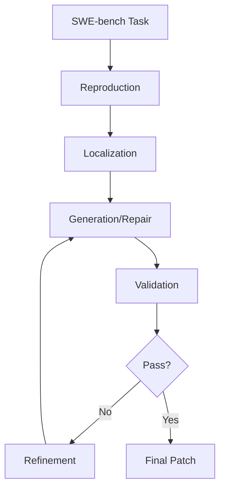

# PatchPilot コードアーキテクチャ解説

このドキュメントは、PatchPilotの各ファイルがどのような機能を実装しているかを関数レベルで解説します。

## 📁 プロジェクト構造

```
patchpilot/
├── reproduce/      # バグ再現・検証モジュール
├── fl/            # 障害位置特定（Fault Localization）モジュール
├── repair/        # パッチ生成・修正モジュール
├── util/          # ユーティリティモジュール
└── model_zoo/     # 言語モデル抽象化レイヤー
```

---

## 1. 🔄 Reproductionモジュール (`patchpilot/reproduce/`)

### `reproduce.py` - バグ再現の中核ファイル

| 関数名 | 機能 | 入出力 |
|-------|------|-------|
| `check_existing_reproduce_ids()` | 既に再現済みのタスクIDを取得 | 入力: reproduce_path<br>出力: 処理済みIDリスト |
| `class LLMRP` | LLMベースのバグ再現クラス | - POC（Proof of Concept）コード生成<br>- バグ再現プロンプト構築 |
| `judge_commit_output()` | LLMでバグ再現結果を判定 | 入力: issue説明、POCコード、実行結果<br>出力: バグ再現成功/失敗判定 |
| `reproduce_instance()` | 1つのタスクのバグ再現実行 | 入力: SWE-benchタスク<br>出力: 再現結果JSON |
| `generate_one_more_poc()` | 追加のPOCコード生成 | 入力: タスク、既存パッチ<br>出力: 新しいPOCコード |
| `execute_reproduce_instance()` | POCコードの実際の実行 | 入力: POCコード<br>出力: stdout/stderr、カバレッジ |
| `reproduce()` | メイン再現処理（並列実行） | 入力: コマンドライン引数<br>出力: 全タスクの再現結果 |

### `verify.py` - パッチ検証

| 関数名 | 機能 | 入出力 |
|-------|------|-------|
| `class LLMVF` | LLMベースの検証クラス | パッチの妥当性を検証 |
| `verify_patch()` | パッチをリポジトリに適用して検証 | 入力: パッチ<br>出力: テスト結果 |
| `run_functionality_tests()` | 機能テスト実行 | 入力: テストコマンド<br>出力: pass/fail |
| `verify_instance()` | 1つのタスクの検証処理 | 入力: タスク、パッチ<br>出力: 検証結果 |

### `task.py` - タスク管理

| 関数名 | 機能 | 入出力 |
|-------|------|-------|
| `make_swe_tasks()` | SWE-benchタスクの読み込み | 入力: タスクリストファイル<br>出力: タスクオブジェクト |
| `parse_task_list_file()` | タスクIDリストのパース | 入力: テキストファイル<br>出力: IDリスト |
| `SWETask` | タスクデータ構造 | リポジトリ情報、issue説明、テストコマンド保持 |

### `formal_verification.py` - 形式的検証

| 関数名 | 機能 | 入出力 |
|-------|------|-------|
| `synthesize_assertion()` | LLMでアサーション生成 | 入力: コード<br>出力: アサーション |
| `verify_with_z3()` | Z3ソルバーでの検証 | 入力: アサーション<br>出力: SAT/UNSAT |

---

## 2. 🎯 Localizationモジュール (`patchpilot/fl/`)

### `localize.py` - 障害位置特定のメインファイル

| 関数名 | 機能 | 入出力 |
|-------|------|-------|
| `localize_instance()` | 1つのタスクの障害位置特定 | 入力: バグ情報、リポジトリ構造<br>出力: 疑わしいファイル/関数/行 |
| `localize()` | 並列障害位置特定処理 | 入力: 全タスク<br>出力: 各タスクの位置特定結果 |
| `merge()` | 複数の位置特定結果をマージ | 入力: 個別結果ファイル<br>出力: 統合JSONLファイル |

**処理の流れ**:
1. リポジトリ構造の取得
2. 再現情報（POC、カバレッジ）の読み込み
3. LLMによるファイルレベル位置特定
4. LLMによる関数レベル位置特定
5. LLMによる行レベル位置特定

### `FL.py` - LLMベースの障害位置特定

| 関数名 | 機能 | 入出力 |
|-------|------|-------|
| `class LLMFL` | LLMベースFLクラス | プロンプト構築と位置特定実行 |
| `localize_files()` | ファイルレベル位置特定 | 入力: issue説明<br>出力: 疑わしいファイルTop-N |
| `localize_functions()` | 関数レベル位置特定 | 入力: ファイル内容<br>出力: 疑わしい関数Top-N |
| `localize_lines()` | 行レベル位置特定 | 入力: 関数内容<br>出力: 疑わしい行番号 |
| `construct_prompt()` | プロンプト構築 | 入力: コンテキスト<br>出力: LLMプロンプト |

---

## 3. 🛠️ Repairモジュール (`patchpilot/repair/`)

### `repair.py` - パッチ生成のメインファイル

| 関数名 | 機能 | 入出力 |
|-------|------|-------|
| `process_loc()` | 位置特定結果を処理してパッチ生成 | 入力: 位置特定結果<br>出力: 生成されたパッチ群 |
| `weighted_sampling()` | 重み付きサンプリング | 多様なモデル/プロンプト選択 |
| `extract_diff_lines()` | パッチから変更行を抽出 | 入力: パッチテキスト<br>出力: 変更行番号 |
| `parse_git_diff_to_dict()` | Git diff形式をパース | 入力: diff文字列<br>出力: ファイル別の変更 |
| `redo_localization()` | 位置特定の再実行 | 入力: 失敗した位置情報<br>出力: 新しい位置情報 |
| `repair()` | メイン修正処理 | 入力: 全タスクの位置情報<br>出力: パッチ候補 |
| `post_process_repair()` | パッチの後処理・整形 | 入力: 生パッチ<br>出力: 整形済みパッチ |
| `get_final_patch_instance()` | 最終パッチ選択 | 入力: 複数候補<br>出力: 最良パッチ |
| `rerank_by_verification()` | 検証結果でパッチを再ランク付け | 入力: パッチ群、検証結果<br>出力: ランク付きパッチ |

**パッチ生成の戦略**:
- Planning Phase: バグ修正計画を立てる
- Generation Phase: 計画に基づいてコード変更を生成
- Refinement Phase: 生成されたパッチを改善

### `bfs.py` - 幅優先探索によるパッチ探索

| 関数名 | 機能 | 入出力 |
|-------|------|-------|
| `vote_outputs_unwrap()` | 複数のLLM出力から投票 | 入力: 生成結果群<br>出力: 最も支持された計画 |
| `apply_plan_step_by_step()` | 計画を段階的に適用 | 入力: 修正計画<br>出力: 実行可能なパッチ |
| `extract_planning()` | LLM出力から計画を抽出 | 入力: LLM応答<br>出力: 構造化された計画 |

### `utils.py` - 修正ユーティリティ

| 関数名 | 機能 | 入出力 |
|-------|------|-------|
| `post_process_raw_output()` | 生のLLM出力を整形 | 入力: LLM応答<br>出力: 有効なパッチ形式 |
| `post_process_raw_output_refine()` | リファインメント用の後処理 | 入力: 既存パッチ<br>出力: 改善されたパッチ |
| `construct_topn_file_context()` | Top-Nファイルのコンテキスト構築 | 入力: ファイルリスト<br>出力: コンテキスト文字列 |
| `validate_patch_format()` | パッチ形式の検証 | 入力: パッチ<br>出力: valid/invalid |

---

## 4. 🔧 Utilityモジュール (`patchpilot/util/`)

### `model.py` - 言語モデル抽象化レイヤー

| クラス/関数名 | 機能 | 対応サービス |
|-------------|------|------------|
| `class DecoderBase` | 基底クラス（抽象クラス） | - |
| `class OpenAIChatDecoder` | OpenAI API統合 | GPT-4, GPT-3.5等 |
| `class ClaudeChatDecoder` | Anthropic API統合 | Claude 3.5等 |
| `class DeepSeekChatDecoder` | DeepSeek API統合 | DeepSeek-Coder |
| `class OllamaChatDecoder` | **Ollama統合（追加）** | phi3, codellama等 |
| `make_model()` | モデルファクトリー関数 | backend引数で切り替え |

**共通インターフェース**:
- `codegen()`: プロンプトからコード生成
- `is_direct_completion()`: 補完モードの判定

### `api_requests.py` - API通信処理

| 関数名 | 機能 | 対応API |
|-------|------|---------|
| `create_chatgpt_config()` | OpenAI API設定作成 | OpenAI |
| `request_chatgpt_engine()` | OpenAI APIリクエスト | OpenAI |
| `create_anthropic_config()` | Anthropic API設定作成 | Claude |
| `request_anthropic_engine()` | Anthropic APIリクエスト | Claude |
| `handle_rate_limit()` | レート制限処理 | 全API |
| `retry_with_backoff()` | 指数バックオフでリトライ | 全API |

### `preprocess_data.py` - データ前処理

| 関数名 | 機能 | 用途 |
|-------|------|------|
| `get_full_file_paths_and_classes_and_functions()` | コード構造抽出 | AST解析でクラス/関数一覧取得 |
| `filter_none_python()` | Pythonファイルのフィルタリング | .py以外を除外 |
| `filter_out_test_files()` | テストファイル除外 | test_*.py等を除外 |
| `transfer_arb_locs_to_locs()` | 位置情報形式変換 | 異なる形式間の変換 |
| `get_repo_structure()` | リポジトリ構造取得 | ファイルツリー生成 |
| `extract_file_content()` | ファイル内容抽出 | 指定範囲のコード取得 |

### `search_tool.py` - コード検索機能

| 関数名 | 機能 | 検索対象 |
|-------|------|----------|
| `search_func_def_with_class_and_file()` | 関数定義検索 | ファイル名、クラス名、関数名で検索 |
| `search_func_def_with_class_and_file_schema()` | OpenAI Function Calling用スキーマ | API統合用 |
| `find_similar_functions()` | 類似関数検索 | コード類似度で検索 |
| `search_by_keywords()` | キーワード検索 | grep的な検索 |

### `utils.py` - 汎用ユーティリティ

| 関数名 | 機能 | 用途 |
|-------|------|------|
| `setup_logger()` | ロガー設定 | デバッグ・監視 |
| `ensure_directory_exists()` | ディレクトリ作成 | 出力フォルダ準備 |
| `load_json()/load_jsonl()` | JSONファイル読み込み | 設定・データ読み込み |
| `save_json()/save_jsonl()` | JSONファイル書き込み | 結果保存 |
| `coverage_to_dict()` | カバレッジデータ変換 | テストカバレッジ解析 |
| `load_existing_instance_ids()` | 処理済みID読み込み | 再実行時のスキップ |

### `utils_for_swe.py` - SWE-bench専用ユーティリティ

| 関数名 | 機能 | 用途 |
|-------|------|------|
| `setup_swe_bench_env()` | SWE-bench環境構築 | Docker環境準備 |
| `run_swe_bench_test()` | SWE-benchテスト実行 | 評価実行 |
| `parse_swe_bench_results()` | 結果パース | スコア計算 |

---

## 5. 🤖 Model Zooモジュール (`patchpilot/model_zoo/`)

外部のLLMバックエンド統合用の追加モジュール：

| ファイル | 機能 | 統合サービス |
|---------|------|------------|
| `litellm_model.py` | LiteLLM統合 | 100+のLLMプロバイダー |
| `vllm_model.py` | vLLM統合 | 高速ローカル推論 |
| `huggingface_model.py` | HuggingFace統合 | Transformersモデル |

---

## 🔄 処理フロー全体像



### 各ステップの主要ファイル

1. **Reproduction**: `reproduce.py` → POCコード生成・実行
2. **Localization**: `localize.py` + `FL.py` → 障害位置特定
3. **Generation**: `repair.py` + `bfs.py` → パッチ生成
4. **Validation**: `verify.py` → テスト実行
5. **Refinement**: `repair.py` (refine_mod) → パッチ改善

---

## 🎯 拡張ポイント

### Phase 1: Repograph統合
- `localize.py`: コードグラフ情報の追加
- `FL.py`: グラフベースの位置特定アルゴリズム

### Phase 2: KGCompass統合  
- `preprocess_data.py`: GitHub issue/PR情報の抽出
- `search_tool.py`: 知識グラフベースの検索

### 無料LLM統合（完了）
- `model.py`: OllamaChatDecoder追加
- 各ステップ: `--backend ollama`オプション追加

---

このドキュメントを参照しながら、各ファイルの詳細な実装を理解し、必要に応じて拡張できます。