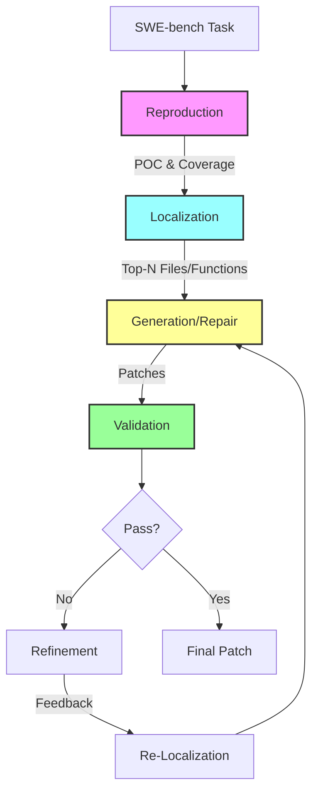

# PatchPilot コードアーキテクチャ詳細解説

このドキュメントは、PatchPilotの各ファイルがどのような機能を実装しているかを関数レベルで詳細に解説します。

## 📁 プロジェクト構造

```
patchpilot/
├── reproduce/      # バグ再現・検証モジュール
├── fl/            # 障害位置特定（Fault Localization）モジュール  
├── repair/        # パッチ生成・修正モジュール
├── util/          # ユーティリティモジュール
└── model_zoo/     # 言語モデル抽象化レイヤー
```

---

## 1. 🔄 Reproductionモジュール (`patchpilot/reproduce/`)

### 概要
バグを自動的に再現し、修正パッチを検証するモジュール。LLMを使用してPOC（Proof of Concept）コードを生成し、実際に実行してバグの存在を確認します。

### 処理フロー
```
1. タスク読み込み → 2. POCコード生成 → 3. POC実行 → 4. 結果判定 → 5. カバレッジ収集
                         ↑                                      ↓
                         └─────── 失敗時は再生成 ←──────────────┘
```

### `reproduce.py` - バグ再現の中核ファイル

| 関数名 | 詳細機能 | 処理内容 |
|-------|---------|---------|
| `check_existing_reproduce_ids()` | 処理済みタスクの確認 | - reproduce_folderから既存の結果ファイルを検索<br>- 重複処理を防ぐためのIDリスト生成<br>- ファイル形式: `{instance_id}/issue_parsing_report_*.json` |
| `class LLMRP` | LLMベースのバグ再現クラス | - `parse_issue()`: issue説明からPOCコードを生成<br>- `clean_and_parse_json()`: LLM出力からJSON部分を抽出<br>- プロンプトテンプレートを使用した対話的な改善 |
| `judge_commit_output()` | バグ再現の成否判定 | - POC実行結果（stdout/stderr）を分析<br>- 期待される動作と実際の動作を比較<br>- LLMで「バグが再現できたか」を判断 |
| `reproduce_instance()` | 単一タスクの完全な再現処理 | 1. リポジトリのクローン・チェックアウト<br>2. 依存関係のインストール<br>3. POCコード生成（最大3回リトライ）<br>4. POC実行とカバレッジ測定<br>5. 結果のJSON保存 |
| `generate_one_more_poc()` | 追加POC生成（リファインメント用） | - 既存のパッチを考慮したPOC生成<br>- パッチ適用前後の動作差を検証<br>- より精密なテストケース作成 |
| `execute_reproduce_instance()` | POCコードの隔離実行 | - Dockerコンテナ内での安全な実行<br>- タイムアウト制御（デフォルト120秒）<br>- stdout/stderr/exit_codeの収集<br>- coverage.pyでカバレッジ情報取得 |
| `reproduce()` | 並列バグ再現のメインループ | - ThreadPoolExecutorで並列処理<br>- 各タスクを独立したスレッドで実行<br>- 進捗状況のロギング<br>- エラーハンドリングと再試行 |

### `verify.py` - パッチ検証

| 関数名 | 詳細機能 | 処理内容 |
|-------|---------|---------|
| `class LLMVF` | LLMベースの検証クラス | - パッチの妥当性を言語モデルで評価<br>- 修正が問題を解決しているか判定<br>- 副作用の検出 |
| `verify_patch()` | パッチ適用と検証 | 1. git applyでパッチ適用<br>2. 既存テストスイート実行<br>3. POCコードでの検証<br>4. パッチのロールバック |
| `run_functionality_tests()` | 機能テストの実行 | - pytest/unittestなどのテスト実行<br>- テストコマンドは`tasks_map.json`から取得<br>- pass/fail/errorの判定<br>- タイムアウト処理 |
| `verify_instance()` | 単一パッチの完全検証 | 1. リポジトリ準備<br>2. パッチ適用<br>3. 全テスト実行<br>4. POCでの動作確認<br>5. 結果の記録 |

### `task.py` - タスク管理

| 関数名 | 詳細機能 | 処理内容 |
|-------|---------|---------|
| `make_swe_tasks()` | SWE-benchタスクオブジェクトの生成 | - タスクIDリストから完全なタスク情報を構築<br>- setup_map.jsonから環境設定読み込み<br>- tasks_map.jsonからテスト情報読み込み |
| `parse_task_list_file()` | タスクリストファイルの解析 | - テキストファイルから1行1タスクID読み込み<br>- コメント行（#）のスキップ<br>- 空行の除去 |
| `SWETask` | タスクデータ構造クラス | - `repo`: リポジトリURL<br>- `base_commit`: 対象コミット<br>- `problem_statement`: issue説明<br>- `test_commands`: テストコマンドリスト |

---

## 2. 🎯 Localizationモジュール (`patchpilot/fl/`)

### 概要
バグの原因となっているコード位置を特定するモジュール。多段階のアプローチ（ファイル→関数→行）で徐々に範囲を絞り込みます。

### 処理フロー
```
1. リポジトリ構造取得
    ↓
2. カバレッジ情報取得（あれば）
    ↓
3. ファイルレベル位置特定
    - 全ファイルから疑わしいTop-Nファイルを選択
    - LLMがissue説明とリポジトリ構造から推論
    ↓
4. 関数レベル位置特定
    - 各ファイル内の疑わしい関数を特定
    - ASTを使用した正確な関数境界の特定
    ↓
5. 行レベル位置特定
    - 関数内の具体的な修正必要行を特定
    - コンテキストウィンドウを考慮した範囲特定
    ↓
6. 結果の統合とランキング
```

### `localize.py` - 障害位置特定のメインファイル

| 関数名 | 詳細機能 | 処理内容 |
|-------|---------|---------|
| `localize_instance()` | 単一タスクの完全な位置特定処理 | 1. **準備フェーズ**<br>   - リポジトリ構造の取得（ファイルツリー）<br>   - カバレッジ情報の読み込み（あれば）<br>   - 再現情報（POC）の読み込み<br>2. **ファイルレベル特定**<br>   - 全ファイルリストから候補を選択<br>   - カバレッジファイルがあれば優先<br>3. **関数レベル特定**<br>   - 各ファイルのAST解析<br>   - クラス・関数の境界特定<br>4. **行レベル特定**<br>   - 関数内の具体的な行番号<br>   - 前後のコンテキスト含む |
| `localize()` | 並列位置特定処理のコーディネーター | - ThreadPoolExecutorで複数タスク並列処理<br>- 各タスクの結果を個別JSONファイルに保存<br>- エラーハンドリングとログ記録<br>- 進捗状況の追跡 |
| `merge()` | 複数の位置特定結果の統合 | - 個別の結果ファイルを1つのJSONLに統合<br>- 重複の除去<br>- 結果の正規化と検証<br>- 統計情報の生成 |

### `FL.py` - LLMベースの障害位置特定エンジン

| 関数名 | 詳細機能 | 処理内容 |
|-------|---------|---------|
| `class LLMFL` | LLMベースFLの中核クラス | - プロンプトテンプレート管理<br>- 多段階位置特定の実装<br>- 結果のパースと検証 |
| `localize_files()` | ファイルレベルの位置特定 | **プロンプト構成**:<br>- GitHub issue説明<br>- リポジトリ構造（ツリー形式）<br>- カバレッジ情報（オプション）<br>**処理**:<br>- LLMが最大5ファイルを選択<br>- 重要度順にランキング<br>- ファイルパスの検証 |
| `localize_functions()` | 関数レベルの位置特定 | **プロンプト構成**:<br>- issue説明<br>- ファイル全体のコード<br>- 行番号付きコード表示<br>**処理**:<br>- クラス名または関数名を特定<br>- 複数の候補を許可<br>- AST解析で境界を正確に特定 |
| `localize_lines()` | 行レベルの位置特定 | **プロンプト構成**:<br>- issue説明<br>- 関数のコード（コンテキスト含む）<br>- 具体的な修正指示<br>**処理**:<br>- 修正が必要な行番号を特定<br>- 連続した行の範囲を統合<br>- インデントレベルを考慮 |
| `construct_prompt()` | 動的プロンプト生成 | - テンプレートへの変数埋め込み<br>- コンテキスト情報の最適化<br>- トークン数の管理<br>- 検索結果の組み込み |

---

## 3. 🛠️ Repairモジュール (`patchpilot/repair/`)

### 概要
位置特定結果を基にパッチを生成し、段階的に改善するモジュール。計画立案→実装→検証→改善のサイクルを実行します。

### 処理フロー
```
1. 位置特定結果の読み込み
    ↓
2. 修正計画の立案（Planning Phase）
    - バグの原因分析
    - 期待される動作の定義
    - 修正ステップの計画（最大3ステップ）
    ↓
3. 計画の実行（Generation Phase）
    - 各ステップを順次実行
    - SEARCH/REPLACE形式でパッチ生成
    - 文法チェックと検証
    ↓
4. パッチの統合と最適化
    - 複数のパッチを統合
    - 重複や競合の解決
    ↓
5. 検証とランキング（Validation Phase）
    - テスト実行による検証
    - 成功率でランク付け
    ↓
6. 改善（Refinement Phase）- オプション
    - 失敗したパッチの分析
    - 追加の位置特定
    - パッチの再生成
```

### `repair.py` - パッチ生成のメインファイル

| 関数名 | 詳細機能 | 処理内容 |
|-------|---------|---------|
| `process_loc()` | 位置特定結果からパッチ生成パイプライン | **Phase 1: 準備**<br>- 位置特定ファイルの読み込み<br>- コンテキスト構築（Top-Nファイル）<br>**Phase 2: 計画立案**<br>- 3つの戦略（詳細/通常/最小）<br>- 多様性のためのサンプリング<br>**Phase 3: 実行**<br>- 計画をステップごとに実行<br>- パッチ候補の生成<br>**Phase 4: 後処理**<br>- パッチフォーマット検証<br>- Git diff形式への変換 |
| `weighted_sampling()` | 多様性のための重み付きサンプリング | - モデル選択（GPT-4o, o1-mini等）<br>- 粒度選択（関数/行レベル）<br>- プロンプト戦略選択 |
| `extract_diff_lines()` | パッチから変更行番号を抽出 | - unified diff形式のパース<br>- 追加/削除/変更行の特定<br>- ハンク情報の解析 |
| `parse_git_diff_to_dict()` | Git diff形式を構造化データに変換 | - ファイルごとの変更を分離<br>- メタデータの抽出<br>- パッチの妥当性検証 |
| `redo_localization()` | 失敗時の再位置特定 | - エラーメッセージを基に再検索<br>- より広い範囲での探索<br>- 代替ファイルの特定 |
| `repair()` | 全体的な修正処理のコーディネーター | 1. 全タスクの位置特定結果読み込み<br>2. 並列パッチ生成<br>3. 結果の集約と保存<br>4. 統計情報の生成 |
| `post_process_repair()` | パッチの後処理と整形 | - インデント修正<br>- import文の整理<br>- 重複コードの除去<br>- スタイルの統一 |
| `get_final_patch_instance()` | 最終パッチの選択ロジック | - 複数候補からの選択基準：<br>  1. テスト成功率<br>  2. 変更行数（少ない方が優先）<br>  3. LLMによる品質評価 |
| `rerank_by_verification()` | 検証結果に基づく再ランク付け | - テスト結果の読み込み<br>- 成功/失敗でスコア調整<br>- 最終ランキングの決定 |

### `bfs.py` - 幅優先探索によるパッチ生成

| 関数名 | 詳細機能 | 処理内容 |
|-------|---------|---------|
| `vote_outputs_unwrap()` | 複数のLLM出力から最良計画を選択 | **投票メカニズム**:<br>- 複数の計画案を収集<br>- 共通要素を抽出<br>- 多数決で最良案を決定<br>**評価基準**:<br>- 計画の完全性<br>- ステップの具体性<br>- 実行可能性 |
| `apply_plan_step_by_step()` | 計画を段階的に実行 | **各ステップの処理**:<br>1. ステップの解釈<br>2. 必要なコード部分の特定<br>3. SEARCH/REPLACE編集の生成<br>4. 編集の適用と検証<br>**エラー処理**:<br>- 適用失敗時の代替案生成<br>- コンテキストの再構築 |
| `extract_planning()` | LLM出力から構造化計画を抽出 | - タグベースのパース<br>- ステップとアクションの分離<br>- 依存関係の解析 |
| `apply_search_replace()` | SEARCH/REPLACEパッチの適用 | - パターンマッチング<br>- インデント保持<br>- 複数編集の統合 |

### `utils.py` - 修正ユーティリティ

| 関数名 | 詳細機能 | 処理内容 |
|-------|---------|---------|
| `post_process_raw_output()` | LLM出力をパッチ形式に変換 | - コードブロックの抽出<br>- SEARCH/REPLACE形式の検証<br>- エスケープ文字の処理<br>- 空白文字の正規化 |
| `post_process_raw_output_refine()` | リファインメント専用の後処理 | - 既存パッチとの差分計算<br>- 増分的な改善の適用<br>- 競合の解決 |
| `construct_topn_file_context()` | 位置特定ファイルのコンテキスト構築 | - ファイル内容の取得<br>- 関連部分の抽出<br>- トークン制限内での最適化<br>- 行番号の付与 |
| `validate_patch_format()` | パッチフォーマットの妥当性検証 | - 構文チェック<br>- インデント検証<br>- import文の確認<br>- 変数スコープの確認 |

---

## 4. 🔧 Utilityモジュール (`patchpilot/util/`)

### 概要
全モジュールで共通利用される基盤機能を提供。LLM統合、データ処理、検索機能などを含みます。

### `model.py` - 言語モデル抽象化レイヤー

| クラス/関数名 | 詳細機能 | 実装内容 |
|-------------|---------|---------|
| `class DecoderBase` | 全LLMデコーダーの基底クラス | **必須メソッド**:<br>- `codegen()`: コード生成<br>- `is_direct_completion()`: 補完モード判定<br>**共通パラメータ**:<br>- temperature: 創造性制御<br>- max_new_tokens: 出力長制限<br>- batch_size: バッチ処理サイズ |
| `class OpenAIChatDecoder` | OpenAI API統合実装 | **特徴**:<br>- Function Calling対応<br>- o1/o3モデル特別処理<br>- バッチ処理最適化<br>- 使用量追跡 |
| `class ClaudeChatDecoder` | Anthropic Claude統合 | **特徴**:<br>- Thinking mode対応<br>- XML形式の構造化出力<br>- 長文コンテキスト対応 |
| `class DeepSeekChatDecoder` | DeepSeek API統合 | **特徴**:<br>- Reasoning content抽出<br>- 中国語対応<br>- コスト効率的 |
| `class OllamaChatDecoder` | **Ollama統合（無料LLM）** | **特徴**:<br>- ローカル実行<br>- カスタムモデル対応<br>- 接続テスト機能<br>- トークン数推定 |
| `make_model()` | モデルファクトリー関数 | - backend引数での動的切り替え<br>- 統一インターフェース提供<br>- エラーハンドリング |

### `api_requests.py` - API通信処理

| 関数名 | 詳細機能 | 実装内容 |
|-------|---------|---------|
| `create_chatgpt_config()` | OpenAI API設定オブジェクト生成 | - モデル選択<br>- パラメータ設定<br>- システムプロンプト設定<br>- Function Calling設定 |
| `request_chatgpt_engine()` | OpenAI APIへのリクエスト実行 | - リトライロジック（最大3回）<br>- レート制限処理<br>- エラーハンドリング<br>- レスポンス検証 |
| `create_anthropic_config()` | Claude API設定生成 | - モデルバージョン管理<br>- thinking mode設定<br>- XML応答形式設定 |
| `request_anthropic_engine()` | Anthropic APIリクエスト | - ストリーミング対応<br>- コンテキスト管理<br>- 使用量計算 |
| `handle_rate_limit()` | API制限エラー処理 | - 指数バックオフ<br>- 待機時間計算<br>- リトライ判定 |

### `preprocess_data.py` - データ前処理

| 関数名 | 詳細機能 | 実装内容 |
|-------|---------|---------|
| `get_full_file_paths_and_classes_and_functions()` | コード構造の完全解析 | **AST解析**:<br>- Pythonファイルのパース<br>- クラス定義の抽出<br>- 関数定義の抽出<br>- デコレータ情報<br>**メタデータ**:<br>- 行番号範囲<br>- docstring<br>- 引数情報 |
| `filter_none_python()` | Python以外のファイル除外 | - 拡張子チェック<br>- MIMEタイプ確認<br>- バイナリファイル除外 |
| `filter_out_test_files()` | テストファイルの除外 | - test_*.py パターン<br>- *_test.py パターン<br>- tests/ ディレクトリ |
| `transfer_arb_locs_to_locs()` | 位置情報形式の標準化 | - 異なるツール間の形式変換<br>- 座標系の統一<br>- 相対/絶対パスの変換 |
| `get_repo_structure()` | リポジトリ構造の取得 | - ディレクトリツリー生成<br>- .gitignore考慮<br>- サイズ情報付与 |
| `extract_file_content()` | 指定範囲のコード抽出 | - 行番号ベースの抽出<br>- コンテキスト行の追加<br>- インデント保持 |
| `find_definitions_by_name()` | 名前による定義検索 | - 関数/クラス名での検索<br>- 部分一致対応<br>- スコープ考慮 |
| `find_callers_by_name()` | 関数の呼び出し元検索 | - 静的解析<br>- import追跡<br>- 間接呼び出し検出 |

### `search_tool.py` - コード検索機能

| 関数名 | 詳細機能 | 実装内容 |
|-------|---------|---------|
| `search_func_def_with_class_and_file()` | 高精度な関数定義検索 | **検索パラメータ**:<br>- file_name: ファイルパス<br>- class_name: クラス名（オプション）<br>- func_name: 関数名<br>**マッチング**:<br>- 完全一致優先<br>- 部分一致フォールバック<br>- スコアリング |
| `search_func_def_with_class_and_file_schema()` | OpenAI Function Calling用スキーマ定義 | - パラメータ定義<br>- 型情報<br>- 必須/オプション指定<br>- 説明文 |
| `find_similar_functions()` | コード類似度による関数検索 | - ベクトル化<br>- コサイン類似度<br>- 構造的類似性 |
| `search_by_keywords()` | キーワードベースの全文検索 | - 正規表現対応<br>- 大文字小文字オプション<br>- ファイルフィルタ |

### `utils.py` - 汎用ユーティリティ

| 関数名 | 詳細機能 | 実装内容 |
|-------|---------|---------|
| `setup_logger()` | ロギングシステムの設定 | - ファイル/コンソール出力<br>- ログレベル設定<br>- ローテーション設定<br>- フォーマット定義 |
| `ensure_directory_exists()` | ディレクトリの作成と確認 | - 再帰的作成<br>- 権限設定<br>- エラーハンドリング |
| `load_json()/load_jsonl()` | JSON形式データの読み込み | - エンコーディング処理<br>- エラー時のデフォルト値<br>- スキーマ検証 |
| `save_json()/save_jsonl()` | JSON形式でのデータ保存 | - Pretty print オプション<br>- アトミック書き込み<br>- バックアップ作成 |
| `coverage_to_dict()` | カバレッジデータの構造化 | - coverage.py出力のパース<br>- ファイル別集計<br>- 行番号マッピング |
| `load_existing_instance_ids()` | 処理済みタスクIDの取得 | - 結果ファイルのスキャン<br>- 重複チェック<br>- 部分完了の検出 |

### `utils_for_swe.py` - SWE-bench専用ユーティリティ

| 関数名 | 詳細機能 | 実装内容 |
|-------|---------|---------|
| `setup_swe_bench_env()` | SWE-bench実行環境の構築 | - Dockerイメージ準備<br>- 依存関係インストール<br>- 環境変数設定<br>- ネットワーク設定 |
| `run_swe_bench_test()` | SWE-benchテストスイート実行 | - テストコマンド実行<br>- タイムアウト管理<br>- 結果収集<br>- メトリクス計算 |
| `parse_swe_bench_results()` | 評価結果の解析 | - pass@k計算<br>- 成功率統計<br>- エラー分類<br>- レポート生成 |

---

## 5. 🤖 Model Zooモジュール (`patchpilot/model_zoo/`)

### 概要
様々なLLMプロバイダーとの統合を提供する拡張モジュール。

| ファイル | 詳細機能 | 対応モデル |
|---------|---------|----------|
| `litellm_model.py` | 100+のLLMプロバイダー統合 | - OpenAI互換API全般<br>- Anthropic, Cohere<br>- Azure, AWS Bedrock<br>- Google Vertex AI |
| `vllm_model.py` | 高速ローカル推論エンジン | - LLaMA系モデル<br>- Mistral, Qwen<br>- カスタムモデル<br>- 量子化モデル |
| `huggingface_model.py` | HuggingFace Hub統合 | - Transformersモデル<br>- AutoModel対応<br>- PEFT/LoRA対応<br>- カスタムトークナイザー |

---

## 🔄 処理フロー全体像



### データの流れ

1. **入力**: タスクID（例: `django__django-11001`）
2. **Reproduction**: POCコード + カバレッジ情報 → JSONファイル
3. **Localization**: 疑わしい位置リスト → JSONLファイル
4. **Generation**: パッチ候補群 → JSONLファイル
5. **Validation**: テスト結果 → JSONファイル
6. **出力**: 最終パッチ（Git diff形式）

---

## 🎯 拡張ポイント

### Phase 1: Repograph統合での変更箇所
- **`localize.py`**: 
  - `localize_instance()`にグラフ構築処理追加
  - 依存関係グラフを考慮した位置特定
- **`FL.py`**: 
  - `localize_files()`でグラフベースのランキング
  - 構造的距離を考慮したスコアリング
- **新規追加**: 
  - `graph_builder.py`: AST→グラフ変換
  - `graph_searcher.py`: グラフ探索アルゴリズム

### Phase 2: KGCompass統合での変更箇所  
- **`preprocess_data.py`**: 
  - GitHub API統合でissue/PR取得
  - コミット履歴の解析
- **`search_tool.py`**: 
  - Neo4jクエリ実行
  - 意味的類似検索
- **新規追加**: 
  - `knowledge_graph.py`: KG構築・管理
  - `embedding.py`: テキスト埋め込み生成

### 無料LLM統合（Phase 0 - 完了）
- **`model.py`**: OllamaChatDecoder追加
- **各モジュール**: `--backend ollama`オプション追加
- **設定最適化**: メモリ・速度を考慮したパラメータ調整

---

このドキュメントを参照することで、PatchPilotの内部動作を完全に理解し、効果的な拡張・改善が可能になります。