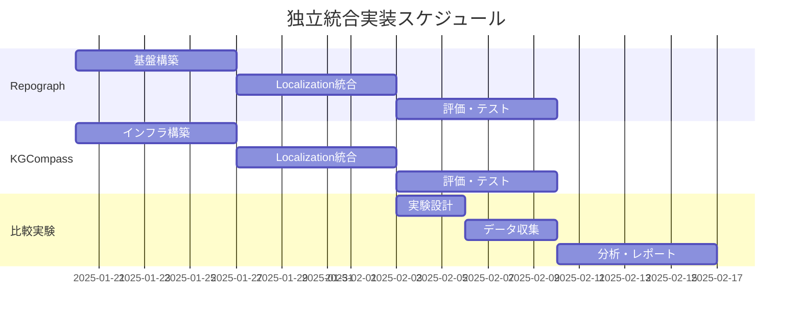

# PatchPilot デュアルグラフ統合計画書
## 構造的グラフ（Repograph）vs 開発文脈グラフ（KGCompass）

## 1. エグゼクティブサマリー

本計画書は、PatchPilotのLocalizationフェーズに2種類の異なるグラフベースアプローチを独立して統合し、その効果を比較検証するための実装計画を示します。

### 研究目的
- **構造的グラフ（Repograph）**: コード間の依存関係・呼び出し関係に基づく障害位置特定
- **開発文脈グラフ（KGCompass）**: Issue/PR/コミット履歴などの開発文脈に基づく障害位置特定
- **比較分析**: 両アプローチの強み・弱みを定量的に評価

---

## 2. Repograph統合計画（構造的グラフ）

### 2.1 概要
**Repograph**は、コードの静的解析により**def/ref関係**を抽出し、NetworkXグラフとして依存関係を構築するシステムです。

### 2.2 提供する情報
- 関数・クラスの定義と参照関係
- メソッド間の呼び出し関係
- ファイル間の依存関係
- **Tree-sitterベースの言語非依存解析**

### 2.3 統合アーキテクチャ

```python
# patchpilot/graph_structural/repograph_integration.py
class RepographIntegration:
    def __init__(self, repo_path):
        self.code_graph = CodeGraph(root=repo_path)
        self.graph = None
        self.tags = None
        
    def build_graph(self):
        """コード構造グラフの構築"""
        files = self.code_graph.find_files([self.repo_path])
        self.tags, self.graph = self.code_graph.get_code_graph(files)
        
    def get_related_files(self, suspicious_functions, depth=2):
        """依存関係に基づく関連ファイル取得"""
        searcher = RepoSearcher(self.graph)
        related_files = set()
        
        for func in suspicious_functions:
            # n-hop neighbors取得
            neighbors = searcher.bfs(func, depth)
            for neighbor in neighbors:
                if neighbor in self.tags:
                    related_files.add(self.tags[neighbor]['file_path'])
        
        return list(related_files)
```

### 2.4 実装ステップ

#### Phase 1: 基盤構築（Week 1）
```bash
# 必要なライブラリ
pip install networkx tree-sitter-languages pygments
```

**タスク**:
1. `patchpilot/graph_structural/`ディレクトリ作成
2. Repographコアモジュール移植
3. キャッシュシステム実装

#### Phase 2: Localization統合（Week 2）
```python
# patchpilot/fl/localize.py への追加
parser.add_argument("--use_repograph", action="store_true",
                   help="Enable structural code graph (Repograph)")
```

#### Phase 3: 評価（Week 3）
- SWE-bench-liteでのベンチマーク
- 精度・再現率の測定

### 2.5 期待される効果
- **強み**: 
  - コードの実際の依存関係を正確に把握
  - 間接的な影響範囲も検出可能
  - 言語非依存で汎用性が高い
- **弱み**:
  - 開発履歴を考慮しない
  - 大規模リポジトリでグラフが巨大化

---

## 3. KGCompass統合計画（開発文脈グラフ）

### 3.1 概要
**KGCompass**は、Neo4jを使用して開発文脈（Issue、PR、コミット履歴）とコード構造を統合した**知識グラフ**を構築するシステムです。

### 3.2 提供する情報
- GitHub Issue/PRの内容と関連性
- コミット履歴による変更パターン
- スタックトレースからの情報抽出
- **Embeddingベースの意味的類似度**
- **重み付きグラフによるランキング**

### 3.3 統合アーキテクチャ

```python
# patchpilot/graph_contextual/kgcompass_integration.py
class KGCompassIntegration:
    def __init__(self, repo_path, github_token, neo4j_config):
        self.kg = KnowledgeGraph(**neo4j_config)
        self.embedder = Embedding()
        self.github_token = github_token
        self.repo_path = repo_path
        
    def build_knowledge_graph(self, issue_data):
        """開発文脈を含む知識グラフ構築"""
        # 1. ルートIssueノード作成
        self.kg.create_issue("root", issue_data['title'], issue_data['content'])
        
        # 2. 関連Issue/PR取得・追加
        self._link_related_issues(issue_data)
        
        # 3. コミット履歴解析
        self._analyze_commit_history()
        
        # 4. スタックトレース解析
        self._extract_stacktrace_info(issue_data['content'])
        
    def rank_files_by_context(self, max_results=20):
        """開発文脈に基づくファイルランキング"""
        results = self.kg.get_similar_entities(
            max_hops=3,
            limit=max_results,
            use_embedding=True
        )
        
        # ファイルごとのスコア集計
        file_rankings = {}
        for entity in results['methods'] + results['classes']:
            file_path = entity['file_path']
            # 重み付き合計スコア
            score = entity['similarity'] * entity.get('weight', 1.0)
            file_rankings[file_path] = max(file_rankings.get(file_path, 0), score)
            
        return sorted(file_rankings.items(), key=lambda x: -x[1])
```

### 3.4 実装ステップ

#### Phase 1: インフラ構築（Week 1）
```bash
# Neo4j Dockerセットアップ
docker run -d \
    --name neo4j-kgcompass \
    -p 7474:7474 -p 7687:7687 \
    -e NEO4J_AUTH=neo4j/password \
    neo4j:5.11.0
    
# 必要なライブラリ
pip install neo4j py2neo sentence-transformers
```

**タスク**:
1. `patchpilot/graph_contextual/`ディレクトリ作成
2. KGCompassコアモジュール移植
3. Neo4j接続管理実装

#### Phase 2: Localization統合（Week 2）
```python
# patchpilot/fl/localize.py への追加
parser.add_argument("--use_kgcompass", action="store_true",
                   help="Enable contextual knowledge graph (KGCompass)")
parser.add_argument("--neo4j_uri", default="bolt://localhost:7687",
                   help="Neo4j connection URI")
```

**重み設定**:
```python
# config.py
STRONG_CONNECTION = 3.0  # 直接的な言及
NORMAL_CONNECTION = 2.0  # 関連Issue/PR
WEAK_CONNECTION = 1.0    # 間接的な参照
DECAY_FACTOR = 0.85      # 距離による減衰
```

#### Phase 3: 評価（Week 3）
- 同じSWE-bench-liteデータセットで評価
- Issue/PR情報の有無による精度差測定

### 3.5 期待される効果
- **強み**:
  - 開発履歴から学習した関連性
  - 自然言語の意味的類似度を考慮
  - 過去の修正パターンを活用
- **弱み**:
  - Neo4jサーバーが必要
  - 初期グラフ構築に時間がかかる
  - Issue/PR情報に依存

---

## 4. 比較実験計画

### 4.1 実験設定

| 項目 | Repograph | KGCompass |
|------|-----------|-----------|
| **入力情報** | コード構造のみ | コード + Issue/PR + コミット |
| **グラフ種別** | 静的依存関係グラフ | 動的知識グラフ |
| **ストレージ** | メモリ（NetworkX） | Neo4j DB |
| **スコアリング** | 距離ベース | 重み付き類似度 |
| **計算時間** | 高速（キャッシュ後） | 中速（DB問い合わせ） |

### 4.2 評価メトリクス

```python
# evaluation/compare_approaches.py
class DualGraphEvaluator:
    def __init__(self, ground_truth):
        self.ground_truth = ground_truth
        
    def evaluate(self, approach_name, predicted_files):
        """各アプローチの評価"""
        metrics = {
            'precision_at_1': self._precision_at_k(predicted_files, 1),
            'precision_at_5': self._precision_at_k(predicted_files, 5),
            'recall_at_10': self._recall_at_k(predicted_files, 10),
            'mean_reciprocal_rank': self._mrr(predicted_files),
            'average_precision': self._ap(predicted_files)
        }
        return metrics
        
    def compare_approaches(self, repograph_results, kgcompass_results):
        """2つのアプローチの比較"""
        comparison = {
            'repograph': self.evaluate('Repograph', repograph_results),
            'kgcompass': self.evaluate('KGCompass', kgcompass_results),
            'hybrid': self._evaluate_hybrid(repograph_results, kgcompass_results)
        }
        return comparison
```

### 4.3 A/Bテスト実行スクリプト

```bash
#!/bin/bash
# run_comparison_experiment.sh

INSTANCE_ID=$1

# Repographのみ
python patchpilot/fl/localize.py \
    --use_repograph \
    --output_folder results/repograph_only \
    --instance_id $INSTANCE_ID

# KGCompassのみ
python patchpilot/fl/localize.py \
    --use_kgcompass \
    --output_folder results/kgcompass_only \
    --instance_id $INSTANCE_ID

# 比較分析
python evaluation/compare_approaches.py \
    --repograph results/repograph_only \
    --kgcompass results/kgcompass_only \
    --output results/comparison_report.json
```

---

## 5. ハイブリッドアプローチの可能性

### 5.1 組み合わせ戦略

```python
class HybridGraphApproach:
    def __init__(self, repograph, kgcompass, alpha=0.5):
        self.repograph = repograph
        self.kgcompass = kgcompass
        self.alpha = alpha  # 重み配分
        
    def rank_files(self, issue_data):
        # 両アプローチでスコア計算
        structural_scores = self.repograph.get_related_files()
        contextual_scores = self.kgcompass.rank_files_by_context()
        
        # 重み付き結合
        combined_scores = {}
        all_files = set(structural_scores.keys()) | set(contextual_scores.keys())
        
        for file in all_files:
            s_score = structural_scores.get(file, 0)
            c_score = contextual_scores.get(file, 0)
            combined_scores[file] = self.alpha * s_score + (1 - self.alpha) * c_score
            
        return sorted(combined_scores.items(), key=lambda x: -x[1])
```

### 5.2 期待される相乗効果

| 観点 | Repograph | KGCompass | ハイブリッド |
|------|-----------|-----------|------------|
| **新規バグ** | ◎ | △ | ◎ |
| **既知パターン** | △ | ◎ | ◎ |
| **リファクタリング影響** | ◎ | △ | ◎ |
| **仕様変更** | △ | ◎ | ◎ |

---

## 6. 実装タイムライン



---

## 7. リスクと対策

| リスク | Repograph | KGCompass | 対策 |
|--------|-----------|-----------|------|
| **スケーラビリティ** | 中（メモリ制限） | 高（DB負荷） | インクリメンタル処理、キャッシュ |
| **データ依存** | 低（コードのみ） | 高（Issue/PR必須） | フォールバック機構 |
| **実装複雑度** | 低 | 高（Neo4j管理） | Docker化、設定自動化 |
| **保守性** | 高 | 中 | モジュール化、テスト充実 |

---

## 8. 成功指標

### 8.1 技術指標
- Repograph: 障害位置特定精度 **+10%向上**（ベースライン比）
- KGCompass: 障害位置特定精度 **+15%向上**（Issue情報活用）
- ハイブリッド: 障害位置特定精度 **+20%向上**（相乗効果）

### 8.2 研究成果
- 構造的グラフと開発文脈グラフの比較論文執筆
- 最適な組み合わせ戦略の発見
- オープンソースとしての公開

---

## 9. 次のステップ

1. **承認取得**: 本計画書のレビューと承認
2. **環境準備**: Docker環境、Neo4jセットアップ
3. **並行開発**: RepographとKGCompassの独立実装
4. **実験実施**: SWE-bench-liteでの比較実験
5. **分析・改善**: 結果分析とハイブリッド手法の開発

---

## 付録: 主要な差異まとめ

| 特徴 | Repograph（構造的） | KGCompass（文脈的） |
|------|-------------------|-------------------|
| **主要な情報源** | ASTとコード解析 | Issue/PR/コミット |
| **グラフの性質** | 静的・決定的 | 動的・確率的 |
| **更新頻度** | コード変更時 | Issue/PR作成時 |
| **言語依存性** | 低（Tree-sitter） | なし（自然言語） |
| **必要リソース** | CPU/メモリ | CPU/メモリ/DB |
| **得意なバグ** | ロジックエラー | 仕様関連 |